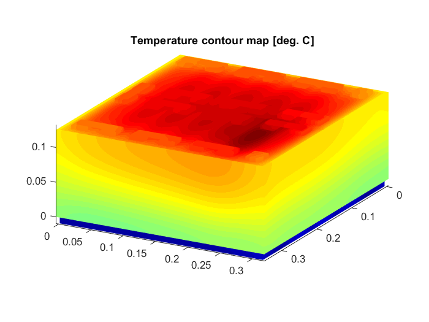
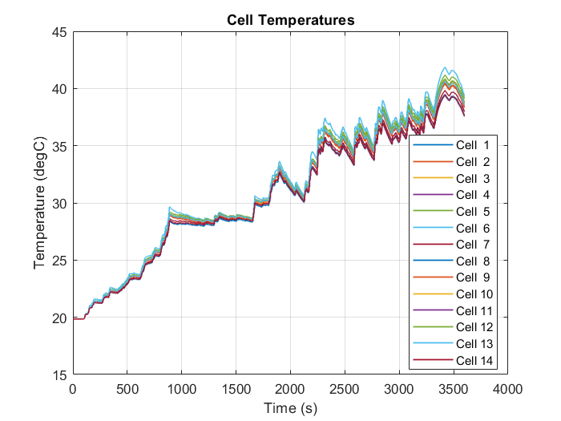
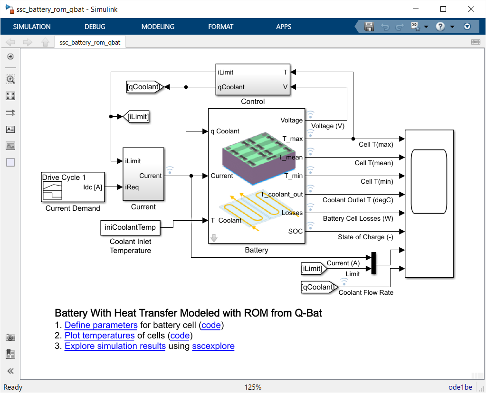
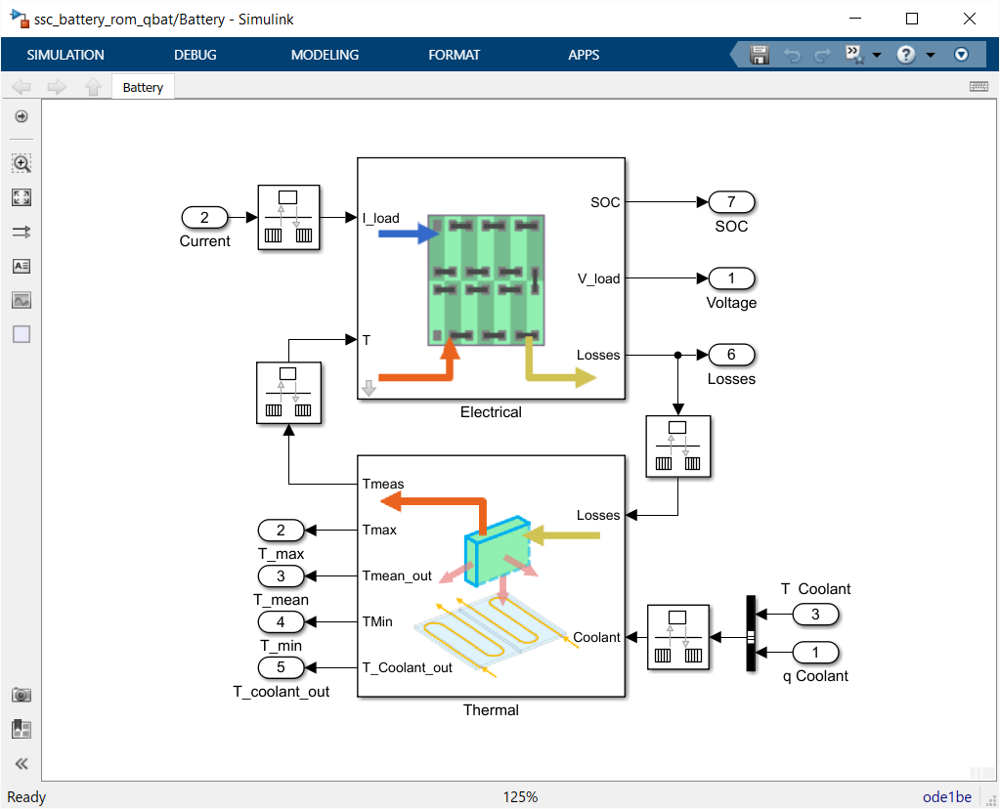
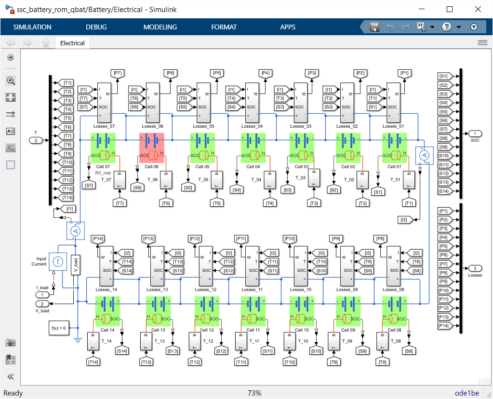

# Battery With Heat Transfer Modeled with ROM from Q-Bat

This repository shows how to model electrothermal behavior of a battery 
with a cooling system by combining Simscape&trade; from MathWorks&reg; and Q-Bat 
from QuickerSim.  A 14-cell battery model with temperature dependent
behavior is connected to a reduced-order model (ROM) to model heat transfer
in 3D geometry.  The ROM models the battery cells, tabs, cooling plate, and
coolant flowing through the cooling plate.

Run startup_ssc_battery_rom_qbat.m to get started 
* Please visit the [Q-Bat](https://www.mathworks.com/products/connections/product_detail/quickersim-q-bat.html) and [QuickerSim](https://emobility.quickersim.com/) 
page to learn more about modeling heat transfer in 3-D systems.
* Please visit the [Simscape Electrical](https://www.mathworks.com/products/simscape-electrical.html) 
page to learn more about modeling electrical systems.

## **Simulation Results with One Faulted Cell**

## **Simulation Model in Simulink**

